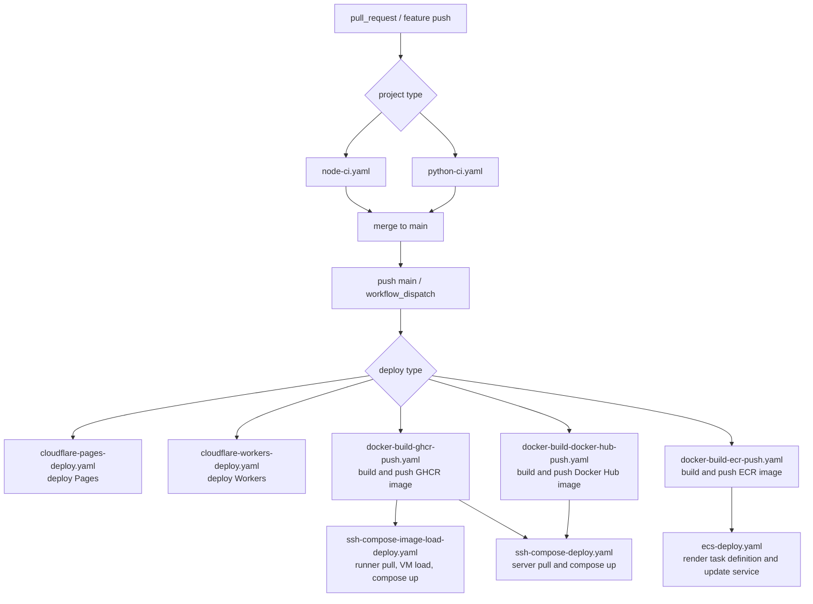
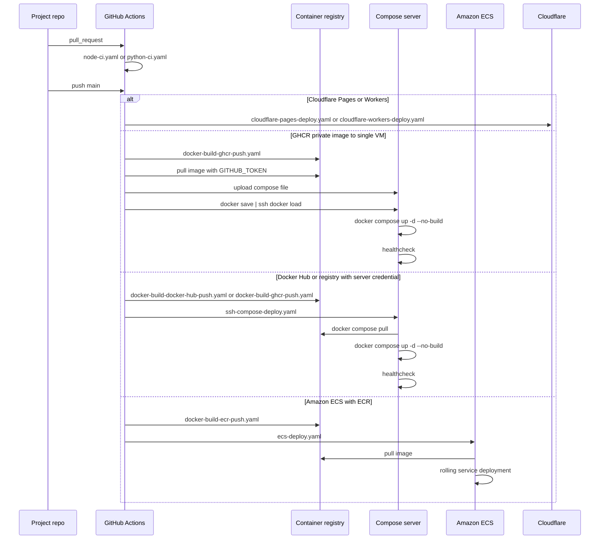

# github-automation

여러 프로젝트에서 공통으로 사용할 GitHub Actions reusable workflow 모음입니다.

프로젝트별 repository에서는 workflow 구현을 길게 두지 않고, 여기 있는 workflow를 `jobs.<job_id>.uses`로 호출합니다. `steps` 안에서 호출하는 방식이 아닙니다.

## Workflows

```text
github-automation
└── .github
    └── workflows
        ├── python-ci.yaml
        ├── node-ci.yaml
        ├── cloudflare-pages-deploy.yaml
        ├── cloudflare-workers-deploy.yaml
        ├── docker-build-ghcr-push.yaml
        ├── docker-build-ecr-push.yaml
        ├── docker-build-docker-hub-push.yaml
        ├── release.yaml
        ├── ecs-deploy.yaml
        ├── ssh-compose-image-load-deploy.yaml
        └── ssh-compose-deploy.yaml
```

| Workflow | 용도 |
| --- | --- |
| `python-ci.yaml` | Python CI |
| `node-ci.yaml` | Node.js CI |
| `cloudflare-pages-deploy.yaml` | Cloudflare Pages deploy |
| `cloudflare-workers-deploy.yaml` | Cloudflare Workers deploy |
| `docker-build-ghcr-push.yaml` | GHCR Docker image build/push |
| `docker-build-ecr-push.yaml` | Amazon ECR Docker image build/push |
| `docker-build-docker-hub-push.yaml` | Docker Hub image build/push |
| `release.yaml` | Release PR, tag, GitHub Release, CHANGELOG |
| `ecs-deploy.yaml` | ECS service deploy |
| `ssh-compose-image-load-deploy.yaml` | Actions runner에서 image pull 후 SSH로 Docker image와 compose file을 전송하는 deploy |
| `ssh-compose-deploy.yaml` | 서버가 registry에서 직접 pull하는 SSH Docker Compose deploy |

## Recommended Flow

일반적으로 PR에서는 CI만 돌리고, `main` merge 이후에 배포 workflow를 실행합니다.



배포 pipeline은 target에 따라 아래처럼 갈라집니다.



## How To Use

각 프로젝트 repo의 `.github/workflows/*.yaml`에서 이 repo의 workflow를 job 단위로 호출합니다.

```yaml
jobs:
  node-ci:
    uses: wibaek/github-automation/.github/workflows/node-ci.yaml@v1.0
```

기본 규칙은 다음과 같습니다.

- reusable workflow는 `jobs.<job_id>.uses`로 호출합니다.
- workflow 버전은 `@v1.0`처럼 tag로 고정합니다.
- 기본 권한은 `contents: read`로 시작합니다.
- Docker image push에는 registry별 workflow를 우선 사용합니다. GHCR은 `docker-build-ghcr-push.yaml`, ECR은 `docker-build-ecr-push.yaml`, Docker Hub는 `docker-build-docker-hub-push.yaml`입니다.
- Docker image push에는 registry에 맞는 권한을 추가합니다. GHCR은 `packages: write`, ECR/ECS는 `id-token: write`가 필요합니다.
- secrets는 호출하는 workflow에서 명시적으로 넘깁니다.
- GHCR private image를 단일 VM에 배포할 때는 `docker-build-ghcr-push.yaml` 뒤에 `ssh-compose-image-load-deploy.yaml`을 붙입니다.
- SSH Compose 배포는 `compose-source-file`로 compose 파일을 업로드하고, `ENV_FILE_CONTENT` secret을 `env-file` 경로로 업로드할 수 있습니다.
- `ssh-compose-image-load-deploy.yaml`은 서버에서 `docker compose up --pull never`를 강제합니다. caller repo의 compose service도 `image: ${IMAGE_REF}`와 `pull_policy: never`를 사용합니다.
- 서버가 registry credential을 직접 관리하는 경우에는 registry별 build/push workflow 뒤에 `ssh-compose-deploy.yaml`을 붙입니다.
- ECS 배포는 `docker-build-ecr-push.yaml` 뒤에 `ecs-deploy.yaml`을 붙입니다.
- 배포 job은 build/push workflow의 `image-reference` output을 받아서 같은 이미지를 배포합니다.
- dev, stage, prod는 같은 deploy workflow를 쓰고 `environment`, host/path/cluster/service 같은 input만 바꿉니다.
- Cloudflare Pages/Workers 배포는 Docker 라인과 별도 adapter workflow를 사용합니다.
- 릴리즈 관리는 `release.yaml`이 담당하고, Docker build/deploy는 별도 job으로 명시적으로 연결합니다.

구체적인 caller YAML 예시는 [docs/workflow-uses](docs/workflow-uses)를 봅니다.

## Versioning

공용 workflow는 SemVer tag로 배포합니다.

```bash
git tag v1.0
git push origin v1.0
```

이미 배포한 tag는 가능한 한 옮기지 않습니다. 같은 tag가 가리키는 코드가 바뀌면 사용하는 프로젝트의 재현성이 깨집니다.

## Docs

- GitHub Actions 기본 개념: [docs/01_github_actions.md](docs/01_github_actions.md)
- Docker build cache와 고급 예시: [docs/02_github_actions_advanced.md](docs/02_github_actions_advanced.md)
- SSH 배포 서버 준비: [docs/03_ssh_deploy_setup.md](docs/03_ssh_deploy_setup.md)
- 프로젝트별 호출 예시: [docs/workflow-uses](docs/workflow-uses)
